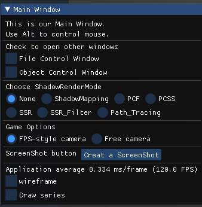
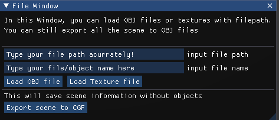
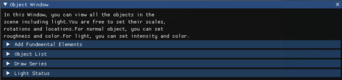
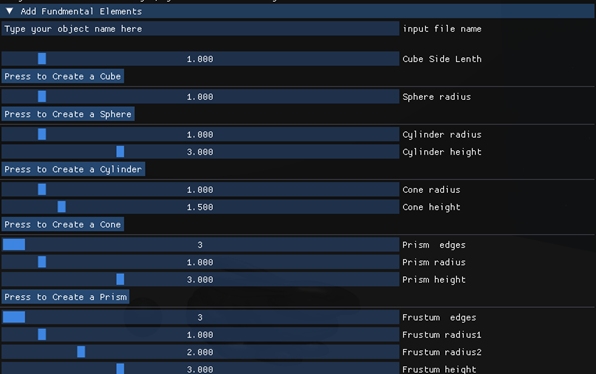
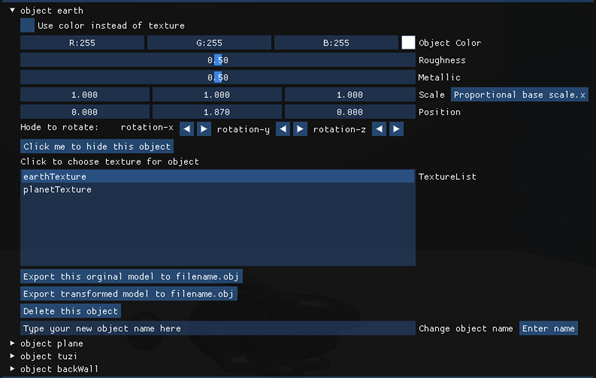
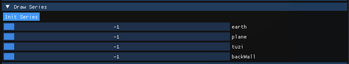
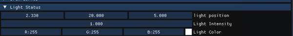
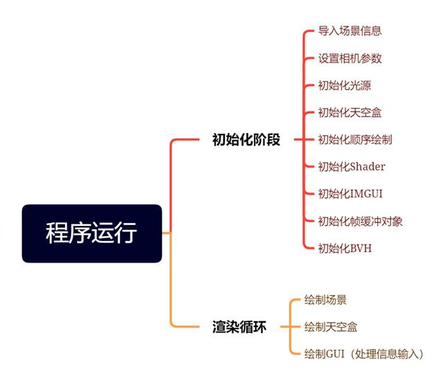

# 计算机图形学大作业报告

##   1.总体说明

这是一个简易功能渲染器的作业程序，在实现基础要求的前提上，我们的额外工作主要集中在照明模型的细化方面。



 这是我们利用imgui编写的交互式窗口，几乎所有针对程序内部的操作都能在此处完成，程序主要有如下功能。

1.1按Alt键使得程序捕捉/释放光标，从而进行相机移动/界面操纵

1.2.1勾选File Control Window打开文件控制窗口



1.2.2输入文件绝对路径或相对路径来载入模型文件或贴图文件，输入file name来决定在程序内部的名称。

1.2.3加载失败，提示Load Failed!

1.2.4 点击Export scene to CGF（CG-Final file）将当前场景信息保存在配置文件info.cgf中，程序运行时自动加载。如果不存在info.cgf，则按照默认设置生成。

1.2.5 勾选Object Control Window 打开物体控制窗口



1.2.6在Add Fundamental Elements子页面下添加立方体等基本体素

​                                             		 

1.2.7在Object List子页面下对物体颜色、材质、旋转、缩放、位置、是否应用纹理、纹理属性、可见性等系列属性进行精细控制



1.2.8子页面下会列出所有物体信息，可以分别控制。每个物体的纹理选择窗口会列出所有已载入的纹理，单击选择

1.2.9点击Export即可进行模型文件导出，结果为name.obj，可以在下方对模型进行改名或者删除



1.2.10在顺序绘制界面，首先需要初始化，然后拖动滑块来选择物体被绘制的顺序，勾选主界面的Draw Series后生效。值为-1则表示该物体始终被绘制。



1.2.11在光源操作界面，能够改变方向光源的位置，强度与颜色

1.3在渲染模式选择界面，能够选择无阴影、ShadowMapping、PCF（百分比渐进滤波）、PCSS（百分比渐进软阴影）、SSR（屏幕空间反射）、SSR_Filter（屏幕空间反射+联合双边滤波）、Path_Tracing（实时光线追踪）的多种渲染模式

1.4在相机模式界面，能够选择FPS风格相机（不能飞行）或是自由相机（能够飞行，移动速度为FPS风格相机的1.2倍，按住Space向上飞行）

1.5 点击Create Screenshot可以创建屏幕快照（不包含GUI界面）到当前文件夹下

## **2.编译运行平台**

​    相对自由，借助CMake构建工程

```cmake
mkdir build
cd build
cmake ..  
```


## **3.程序框架**



## 4.基础模块功能与实现

### 4.1基本体素绘制

这里创建的体素能够被Object页面读取进行调整，并且自动在media文件夹下创建一个新的OBJ文件

**4.1.1立方体**：绘制时针对法向量相同的每个面上顶点分别设置两个三角形，总共设置有36个顶点来避免法向量冲突

```c++
void Scene::AddCube(float l,std::string name){
    std::vector<Vertex> vertices;
    std::vector<uint32_t> indices;
    glm::vec2 t={0.0,0.0};
    glm::vec3 normalx={1.0,0.0,0.0};
    glm::vec3 normaly={0.0,1.0,0.0};
    glm::vec3 normalz={0.0,0.0,1.0};
    glm::vec3 p1={l,l,l};
    glm::vec3 p2={-l,l,l};
    glm::vec3 p3={-l,-l,l};
    glm::vec3 p4={l,-l,l};
    glm::vec3 p5={l,l,-l};
    glm::vec3 p6={-l,l,-l};
    glm::vec3 p7={-l,-l,-l};
    glm::vec3 p8={l,-l,-l};
    // face z+
    vertices.push_back({p1,normalz,t});vertices.push_back({p2,normalz,t});
    vertices.push_back({p3,normalz,t});vertices.push_back({p4,normalz,t});
    indices.push_back(0);indices.push_back(1);indices.push_back(2);
    indices.push_back(0);indices.push_back(2);indices.push_back(3);
    // face z-
    vertices.push_back({p5,-normalz,t});vertices.push_back({p6,-normalz,t});
    vertices.push_back({p7,-normalz,t});vertices.push_back({p8,-normalz,t});
    indices.push_back(4);indices.push_back(5);indices.push_back(6);
    indices.push_back(4);indices.push_back(6);indices.push_back(7);
    // face x+
    vertices.push_back({p1,normalx,t});vertices.push_back({p5,normalx,t});
    vertices.push_back({p8,normalx,t});vertices.push_back({p4,normalx,t});
    indices.push_back(8);indices.push_back(9);indices.push_back(10);
    indices.push_back(8);indices.push_back(10);indices.push_back(11);
    // face x-
    vertices.push_back({p2,-normalx,t});vertices.push_back({p3,-normalx,t});
    vertices.push_back({p7,-normalx,t});vertices.push_back({p6,-normalx,t});
    indices.push_back(12);indices.push_back(13);indices.push_back(14);
    indices.push_back(12);indices.push_back(14);indices.push_back(15);
    // face y+
    vertices.push_back({p1,normaly,t});vertices.push_back({p2,normaly,t});
    vertices.push_back({p6,normaly,t});vertices.push_back({p5,normaly,t});
    indices.push_back(16);indices.push_back(17);indices.push_back(18);
    indices.push_back(16);indices.push_back(18);indices.push_back(19);
    // face y-
    vertices.push_back({p7,-normaly,t});vertices.push_back({p3,-normaly,t});
    vertices.push_back({p4,-normaly,t});vertices.push_back({p8,-normaly,t});
    indices.push_back(20);indices.push_back(21);indices.push_back(22);
    indices.push_back(20);indices.push_back(22);indices.push_back(23);
    
    std::string path="../media/"+name+".obj";
    _objectlist.filepath.push_back(path);
    _objectlist.ModelList.push_back(nullptr);
    _objectlist.objectname.push_back(name);
    _objectlist.ModelList[_objectlist.ModelList.size()-1].reset(new Model(vertices,indices));
    _objectlist.visible.push_back(true);
    _objectlist.Color.push_back(glm::vec3(1.0));
    _objectlist.TextureIndex.push_back(0);
    _objectlist.color_flag.push_back(true);
    _objectlist.roughness.push_back(0.5f);
    _objectlist.metallic.push_back(1.0f);
    exportOBJ(vertices,indices,name);
}
```

**4.1.2圆锥体**：用200边的多边形对底部圆形三角形分割近似处理，然后对侧面的每个三角形按照几何知识添加法向量与顶点

```c++
void Scene::AddCone(float r,float h,std::string name){
    const float PI = 3.14159265359;
    std::vector<Vertex> vertices;
    std::vector<uint32_t> indices;
    glm::vec3 center={0.0,h/2,0.0};
    glm::vec2 t={0.0,0.0};
    glm::vec3 n={0.0,1.0,0.0};
    const int sides=200;
    float a=2*PI/sides;
    float phi=atan(h/r);
    // 0
    vertices.push_back({-center,-n,t});
    // 1 ... sides
    for (int i=0;i<sides;i++){
        vertices.push_back({glm::vec3{r*cos(a),-h/2,r*sin(a)},-n,t});
        a+=2*PI/sides;
    }
    for (int i = 0; i < sides; i++){
        indices.push_back(0);
        indices.push_back(i + 1);
        if (i + 1 >= sides) indices.push_back(1);
        else indices.push_back(i + 2);
    }
    // sides+1 .. 2*sides
    for (int i=0;i<sides;i++){
        glm::vec3 n={sin(phi)*cos(a),cos(phi),sin(phi)*sin(a)};
        vertices.push_back({glm::vec3{r*cos(a),-h/2,r*sin(a)},n,t});
        a+=2*PI/sides;
    }
    // 2*sides+1 .. 3*sides
    for (int i=0;i<sides;i++){
        glm::vec3 n={sin(phi)*cos(a),cos(phi),sin(phi)*sin(a)};
        vertices.push_back({glm::vec3{0.0,0.0,0.0},n,t});
        a+=2*PI/sides;
    }
    vertices.push_back({center,n,t});
    for (int i = sides+1; i < 2*sides+1; i++){
        if (i+sides+1>=3*sides) indices.push_back(2*sides+1);
        else indices.push_back(i+sides+1);
        indices.push_back(i);
        if (i + 1 >= 2*sides+1) indices.push_back(sides+1);
        else indices.push_back(i + 1);
    }

    std::string path="../media/"+name+".obj";
    _objectlist.filepath.push_back(path);
    _objectlist.ModelList.push_back(nullptr);
    _objectlist.objectname.push_back(name);
    _objectlist.ModelList[_objectlist.ModelList.size()-1].reset(new Model(vertices,indices));
    _objectlist.visible.push_back(true);
    _objectlist.Color.push_back(glm::vec3(1.0));
    _objectlist.TextureIndex.push_back(0);
    _objectlist.color_flag.push_back(true);
    _objectlist.roughness.push_back(0.5f);
    _objectlist.metallic.push_back(1.0f);
    exportOBJ(vertices,indices,name);
}
```

 **4.1.3圆柱体**：在圆锥体的基础上稍加修改，改为顶面与底面共两个，并且按照索引的规律补充添加出侧面结果

```c++
void Scene::AddCylinder(float r,float h,std::string name){
    const float PI = 3.14159265359;
    std::vector<Vertex> vertices;
    std::vector<uint32_t> indices;
    glm::vec3 center={0.0,h/2,0.0};
    glm::vec2 t={0.0,0.0};
    glm::vec3 n={0.0,1.0,0.0};
    vertices.push_back({center,n,t});
    const int sides=100;
    float a=2*PI/sides;
    for (int i=0;i<sides;i++){
        vertices.push_back({glm::vec3{r*cos(a),h/2,r*sin(a)},n,t});
        a+=2*PI/sides;
    }
    vertices.push_back({-center,-n,t});
    for (int i=0;i<sides;i++){
        vertices.push_back({glm::vec3{r*cos(a),-h/2,r*sin(a)},-n,t});
        a+=2*PI/sides;
    }
    for (int i = 0; i < sides; i++){
        indices.push_back(0);
        indices.push_back(i + 1);
        if (i + 1 >= sides) indices.push_back(1);
        else indices.push_back(i + 2);
    }
    for (int i = sides + 1; i < 2 * sides + 1; i++){
        indices.push_back(sides + 1);
        if (i + 2 >= 2 * sides + 2) indices.push_back(sides + 2);
        else indices.push_back(i + 2);
        indices.push_back(i + 1);
    }
    // 2*side + 2 ... 3*side + 1
    for (int i=0;i<sides;i++){
        vertices.push_back({glm::vec3{r*cos(a),h/2,r*sin(a)},glm::vec3{cos(a),0.0,sin(a)},t});
        a+=2*PI/sides;
    }
    // 3*side + 2 ... 4*side +1
    for (int i=0;i<sides;i++){
        vertices.push_back({glm::vec3{r*cos(a),-h/2,r*sin(a)},glm::vec3{cos(a),0.0,sin(a)},t});
        a+=2*PI/sides;
    }
    for (int i=2*sides+2;i<3*sides+2;i++){
        indices.push_back(i);
        if(i+1>=3*sides+2) indices.push_back(2*sides+2);
        else indices.push_back(i+1);
        indices.push_back(i+sides);
        if(i+1>=3*sides+2) indices.push_back(2*sides+2);
        else indices.push_back(i+1);
        indices.push_back(i+sides);
        if(i+sides+1>=4*sides+2) indices.push_back(3*sides+2);
        else indices.push_back(i+sides+1);
    }

    std::string path="../media/"+name+".obj";
    _objectlist.filepath.push_back(path);
    _objectlist.ModelList.push_back(nullptr);
    _objectlist.objectname.push_back(name);
    _objectlist.ModelList[_objectlist.ModelList.size()-1].reset(new Model(vertices,indices));
    _objectlist.visible.push_back(true);
    _objectlist.Color.push_back(glm::vec3(1.0));
    _objectlist.TextureIndex.push_back(0);
    _objectlist.color_flag.push_back(true);
    _objectlist.roughness.push_back(0.5f);
    _objectlist.metallic.push_back(1.0f);
    exportOBJ(vertices,indices,name);
}
```

**4.1.4多面棱台**：在圆柱的代码基础上稍加修改，将顶面和底面的半径彼此分离，同时对法向量进行细节性处理，指向面的中心

```c++
void Scene::AddFrustum(float r1,float r2,float h,std::string name,int sides){
    const float PI = 3.14159265359;
    std::vector<Vertex> vertices;
    std::vector<uint32_t> indices;
    glm::vec3 center={0.0,h/2,0.0};
    glm::vec2 t={0.0,0.0};
    glm::vec3 n={0.0,1.0,0.0};
    vertices.push_back({center,n,t});
    float a=2*PI/sides;
    for (int i=0;i<sides;i++){
        vertices.push_back({glm::vec3{r1*cos(a),h/2,r1*sin(a)},n,t});
        a+=2*PI/sides;
    }
    vertices.push_back({-center,-n,t});
    for (int i=0;i<sides;i++){
        vertices.push_back({glm::vec3{r2*cos(a),-h/2,r2*sin(a)},-n,t});
        a+=2*PI/sides;
    }
    for (int i = 0; i < sides; i++){
        indices.push_back(0);
        indices.push_back(i + 1);
        if (i + 1 >= sides) indices.push_back(1);
        else indices.push_back(i + 2);
    }
    for (int i = sides + 1; i < 2 * sides + 1; i++){
        indices.push_back(sides + 1);
        if (i + 2 >= 2 * sides + 2) indices.push_back(sides + 2);
        else indices.push_back(i + 2);
        indices.push_back(i + 1);
    }
    // 2*side + 2 ... 4*side + 1
    for (int i=0;i<sides;i++){
        vertices.push_back({glm::vec3{r1*cos(a),h/2,r1*sin(a)},glm::vec3{cos(a+PI/sides),0.0,sin(a+PI/sides)},t});
        vertices.push_back({glm::vec3{r1*cos(a+2*PI/sides),h/2,r1*sin(a+2*PI/sides)},glm::vec3{cos(a+PI/sides),0.0,sin(a+PI/sides)},t});
        a+=2*PI/sides;
    }
    // 5*side + 2 ... 6*side +1
    for (int i=0;i<sides;i++){
        vertices.push_back({glm::vec3{r2*cos(a),-h/2,r2*sin(a)},glm::vec3{cos(a+PI/sides),0.0,sin(a+PI/sides)},t});
        vertices.push_back({glm::vec3{r2*cos(a+2*PI/sides),-h/2,r2*sin(a+2*PI/sides)},glm::vec3{cos(a+PI/sides),0.0,sin(a+PI/sides)},t});
        a+=2*PI/sides;
    }
    for (int i=2*sides+2;i<4*sides+2;i=i+2){
        indices.push_back(i);
        if(i+1>=4*sides+2) indices.push_back(2*sides+2);
        else indices.push_back(i+1);
        indices.push_back(i+2*sides);
        if(i+1>=4*sides+2) indices.push_back(2*sides+2);
        else indices.push_back(i+1);
        indices.push_back(i+2*sides);
        if(i+2*sides+1>=6*sides+2) indices.push_back(4*sides+2);
        else indices.push_back(i+2*sides+1);
    }

    std::string path="../media/"+name+".obj";
    _objectlist.filepath.push_back(path);
    _objectlist.ModelList.push_back(nullptr);
    _objectlist.objectname.push_back(name);
    _objectlist.ModelList[_objectlist.ModelList.size()-1].reset(new Model(vertices,indices));
    _objectlist.visible.push_back(true);
    _objectlist.Color.push_back(glm::vec3(1.0));
    _objectlist.TextureIndex.push_back(0);
    _objectlist.color_flag.push_back(true);
    _objectlist.roughness.push_back(0.5f);
    _objectlist.metallic.push_back(1.0f);
    exportOBJ(vertices,indices,name);
}
```

**4.1.5 多面棱柱**：相当于是多面棱台的特殊情形，顶面和底面的半径彼此相同，代码部分就不加以赘述了。

```c++
void Scene::AddPrism(float r,float h,std::string name,int sides){
    const float PI = 3.14159265359;
    std::vector<Vertex> vertices;
    std::vector<uint32_t> indices;
    glm::vec3 center={0.0,h/2,0.0};
    glm::vec2 t={0.0,0.0};
    glm::vec3 n={0.0,1.0,0.0};
    vertices.push_back({center,n,t});
    float a=2*PI/sides;
    for (int i=0;i<sides;i++){
        vertices.push_back({glm::vec3{r*cos(a),h/2,r*sin(a)},n,t});
        a+=2*PI/sides;
    }
    vertices.push_back({-center,-n,t});
    for (int i=0;i<sides;i++){
        vertices.push_back({glm::vec3{r*cos(a),-h/2,r*sin(a)},-n,t});
        a+=2*PI/sides;
    }
    for (int i = 0; i < sides; i++){
        indices.push_back(0);
        indices.push_back(i + 1);
        if (i + 1 >= sides) indices.push_back(1);
        else indices.push_back(i + 2);
    }
    for (int i = sides + 1; i < 2 * sides + 1; i++){
        indices.push_back(sides + 1);
        if (i + 2 >= 2 * sides + 2) indices.push_back(sides + 2);
        else indices.push_back(i + 2);
        indices.push_back(i + 1);
    }
    // 2*side + 2 ... 4*side + 1
    for (int i=0;i<sides;i++){
        vertices.push_back({glm::vec3{r*cos(a),h/2,r*sin(a)},glm::vec3{cos(a+PI/sides),0.0,sin(a+PI/sides)},t});
        vertices.push_back({glm::vec3{r*cos(a+2*PI/sides),h/2,r*sin(a+2*PI/sides)},glm::vec3{cos(a+PI/sides),0.0,sin(a+PI/sides)},t});
        a+=2*PI/sides;
    }
    // 5*side + 2 ... 6*side +1
    for (int i=0;i<sides;i++){
        vertices.push_back({glm::vec3{r*cos(a),-h/2,r*sin(a)},glm::vec3{cos(a+PI/sides),0.0,sin(a+PI/sides)},t});
        vertices.push_back({glm::vec3{r*cos(a+2*PI/sides),-h/2,r*sin(a+2*PI/sides)},glm::vec3{cos(a+PI/sides),0.0,sin(a+PI/sides)},t});
        a+=2*PI/sides;
    }
    for (int i=2*sides+2;i<4*sides+2;i=i+2){
        indices.push_back(i);
        if(i+1>=4*sides+2) indices.push_back(2*sides+2);
        else indices.push_back(i+1);
        indices.push_back(i+2*sides);
        if(i+1>=4*sides+2) indices.push_back(2*sides+2);
        else indices.push_back(i+1);
        indices.push_back(i+2*sides);
        if(i+2*sides+1>=6*sides+2) indices.push_back(4*sides+2);
        else indices.push_back(i+2*sides+1);
    }

    std::string path="../media/"+name+".obj";
    _objectlist.filepath.push_back(path);
    _objectlist.ModelList.push_back(nullptr);
    _objectlist.objectname.push_back(name);
    _objectlist.ModelList[_objectlist.ModelList.size()-1].reset(new Model(vertices,indices));
    _objectlist.visible.push_back(true);
    _objectlist.Color.push_back(glm::vec3(1.0));
    _objectlist.TextureIndex.push_back(0);
    _objectlist.color_flag.push_back(true);
    _objectlist.roughness.push_back(0.5f);
    _objectlist.metallic.push_back(1.0f);
    exportOBJ(vertices,indices,name);
}
```

### **4.2** **三维网格导入导出功能**

​    导入OBJ格式的内容在micro_obj_loader.h中完成，没有处理OBJ格式中自带的材质等信息，放弃了对group的处理而将它们视为一个整体，同时对model.cpp中的内容进行了一定程度的修改。

​    考虑到确保读取效果安全可靠性的因素，这里借鉴引用了tinyobjloader中已有的读取浮点数等功能的函数，首先读取顶点法线与纹理坐标，随后针对多边形面进行分割处理，最终以面为单位返回读取结果。

```c++
bool MicroLoadObj(attrib_t * attrib, face_indices_t * face_indices,const char *filename){
    std::vector<float> v;
    std::vector<float> vn;
    std::vector<float> vt;
    std::vector<index_t> face;
    attrib->vertices.clear();
    attrib->normals.clear();
    face_indices->clear();
    std::ifstream ifs(filename);
    if (!ifs) return false;
    std::string linebuf;
    while (ifs.peek() != -1) {
        safeGetline(ifs, linebuf);
        // 清洗
        if (linebuf.size() > 0) 
        {
            if (linebuf[linebuf.size() - 1] == '\n')
                linebuf.erase(linebuf.size() - 1);
        }
        if (linebuf.size() > 0) 
        {
            if (linebuf[linebuf.size() - 1] == '\r')
                linebuf.erase(linebuf.size() - 1);
        }
        // 跳过空白行
        if (linebuf.empty()) 
        {
            continue;
        }
        // 跳过先导空格
        const char *token = linebuf.c_str();
        token += strspn(token, " \t");
        if (token[0] == '\0') continue;  // 空白行
        if (token[0] == '#') continue;  // 注释行
        // 顶点处理
        if (token[0] == 'v' && IS_SPACE((token[1]))) 
        {
            token += 2;
            float x, y, z;
            parseReal3(&x, &y, &z, &token);
            v.push_back(x);
            v.push_back(y);
            v.push_back(z);
            continue;
        }
        // 法线处理
        if (token[0] == 'v' && token[1] == 'n' && IS_SPACE((token[2]))) 
        {
            token += 3;
            float x, y, z;
            parseReal3(&x, &y, &z, &token);
            vn.push_back(x);
            vn.push_back(y);
            vn.push_back(z);
            continue;
        }
        // 纹理坐标
        if (token[0] == 'v' && token[1] == 't' && IS_SPACE((token[2]))) {
            token += 3;
            float x, y;
            parseReal2(&x, &y, &token);
            vt.push_back(x);
            vt.push_back(y);
            continue;
        }
        // 面处理
        if (token[0] == 'f' && IS_SPACE((token[1]))) 
        {
            std::vector<vertex_index> sface;
            sface.reserve(3);
            token += 2;
            token += strspn(token, " \t");
            while (!IS_NEW_LINE(token[0])) {
                vertex_index vi = parseTriple(&token, static_cast<int>(v.size() / 3),
                                            static_cast<int>(vn.size() / 3),
                                            static_cast<int>(vt.size() / 2));
                sface.push_back(vi);
                size_t n = strspn(token, " \t\r");
                token += n;
            }
            // 将多边形面处理成三角形面
            vertex_index i0 = sface[0];
            vertex_index i1(-1);
            vertex_index i2 = sface[1];
            size_t npolys = sface.size();
            for (size_t k = 2; k < npolys; k++) {
              i1 = i2;
              i2 = sface[k];
              // 递归得到三个下标
              index_t idx0, idx1, idx2;
              idx0.vertex_index = i0.v_idx;
              idx0.normal_index = i0.vn_idx;
              idx0.texcoord_index = i0.vt_idx;
              idx1.vertex_index = i1.v_idx;
              idx1.normal_index = i1.vn_idx;
              idx1.texcoord_index = i1.vt_idx;
              idx2.vertex_index = i2.v_idx;
              idx2.normal_index = i2.vn_idx;
              idx2.texcoord_index = i2.vt_idx;
              face.push_back(idx0);
              face.push_back(idx1);
              face.push_back(idx2);
            }
            continue;
        }
    }
    attrib->normals.swap(vn);
    attrib->vertices.swap(v);
    attrib->texcoords.swap(vt);
    face_indices->swap(face);
    return true;
}
```

​    导出OBJ格式的内容在global.h中完成，有按照原样导出的选项和导出变换后的顶点/法线坐标的选项。这里仍然是以面为单位进行的导出，使得OBJ格式中存在有信息冗余等不可抗拒因素。

```c++
void Scene::exportOBJ(const std::vector<Vertex> _vertices,const std::vector<uint32_t> _indices,std::string filename){
    std::ofstream ofs;
    std::string filepath = "../media/" + filename + ".obj";
    ofs.open(filepath,std::ios::out|std::ios::trunc);
    for (int i=0;i<_vertices.size();i++) 
        ofs<<"v "<<_vertices[i].position.x<<" "<<_vertices[i].position.y<<" "<<_vertices[i].position.z<<std::endl;
    for (int i=0;i<_vertices.size();i++) 
        ofs<<"vt "<<_vertices[i].texCoord.x<<" "<<_vertices[i].texCoord.y<<std::endl;
    for (int i=0;i<_vertices.size();i++) 
        ofs<<"vn "<<_vertices[i].normal.x<<" "<<_vertices[i].normal.y<<" "<<_vertices[i].normal.z<<std::endl;
    for (int i=0;i<_indices.size();i=i+3){
        ofs<<"f "<<_indices[i]+1<<"/"<<_indices[i]+1<<"/"<<_indices[i]+1<<" "<<
        _indices[i+1]+1<<"/"<<_indices[i+1]+1<<"/"<<_indices[i+1]+1<<" "<<
        _indices[i+2]+1<<"/"<<_indices[i+2]+1<<"/"<<_indices[i+2]+1<<std::endl;
    }
    ofs.close();
}

void Scene::exportTransOBJ(const std::vector<Vertex> _vertices,const std::vector<uint32_t> _indices,std::string filename,glm::mat4 model){
    std::ofstream ofs;
    std::string filepath = "../media/" + filename + ".obj";
    ofs.open(filepath,std::ios::out|std::ios::trunc);
    for (int i=0;i<_vertices.size();i++) {
        glm::vec3 position=model*glm::vec4(_vertices[i].position,1.0f);
        ofs<<"v "<<position.x<<" "<<position.y<<" "<<position.z<<std::endl;
    }
    for (int i=0;i<_vertices.size();i++) 
        ofs<<"vt "<<_vertices[i].texCoord.x<<" "<<_vertices[i].texCoord.y<<std::endl;
    for (int i=0;i<_vertices.size();i++) {
        glm::vec3 normal=model*glm::vec4(_vertices[i].normal,0.0f);
        ofs<<"vn "<<normal.x<<" "<<normal.y<<" "<<normal.z<<std::endl;
    }
    for (int i=0;i<_indices.size();i=i+3){
        ofs<<"f "<<_indices[i]+1<<"/"<<_indices[i]+1<<"/"<<_indices[i]+1<<" "<<
        _indices[i+1]+1<<"/"<<_indices[i+1]+1<<"/"<<_indices[i+1]+1<<" "<<
        _indices[i+2]+1<<"/"<<_indices[i+2]+1<<"/"<<_indices[i+2]+1<<std::endl;
    }
    ofs.close();
}
```


### **4.3** **基本材质、纹理的显示和编辑功能**

​    纹理载入，首先给保存纹理的vector添加一个新的unique指针，载入成功的话顺便保存纹理的名称，载入失败的话删除当前指针并且返回FALSE。

```c++
bool Scene::addTexture(const std::string filename,const std::string name){
    _texturelist.texture.push_back(nullptr);
	_texturelist.texture[_texturelist.texture.size()-1].reset(new Texture2D(filename));
    if(!_texturelist.texture[_texturelist.texture.size()-1]->success){
        _texturelist.texture.pop_back();
        return false;
    }
    _texturelist.filepath.push_back(filename);
    _texturelist.texturename.push_back(name);
    return true;
}
```

​    纹理显示和编辑，在IMGUI里利用for循环遍历所有的纹理，并且返回当前选中的值，将这个值所对应的纹理应用到这个物体上。

```c++
if (ImGui::BeginListBox("TextureList"))
    {
        for (int n = 0; n < _texturelist.texturename.size(); n++)
        {
            const bool is_selected = (texture_current_idx == n);
            if (ImGui::Selectable(_texturelist.texturename[n].c_str(), is_selected)){
                texture_current_idx = n;
                _objectlist.TextureIndex[i]=texture_current_idx;
            }
            if (is_selected)
                ImGui::SetItemDefaultFocus();
        }
        ImGui::EndListBox();
    }
```

​    基本材质处理，一共有漫反射颜色、粗糙度与金属度总共三项，分别通过IMGUI调整。其中粗糙度决定了GGX法线分布函数的形状，金属度决定了BRDF中的菲涅尔项里F0的初值，漫反射颜色决定了Diffuse项的颜色属性，具体的内容在后续的PBR实现部分介绍。

### **4.4**基本的几何变换功能

​    在程序中能对所有被视为Object的对象进行包括位移、旋转、缩放在内的几何变换，位移和缩放是利用IMGUI读入的变换信息进行的，旋转是通过调节旋钮来应用四元数变换进行的，这些信息会在Model类内部自行处理，并且转化为模型矩阵。

```c++
ImGui::DragFloat3("Scale",scale,0.005f,0.0f,10.0f,"%.3f");ImGui::SameLine();
    if(ImGui::Button("Proportional base scale.x")){
        scale[2]=scale[1]=scale[0];  
    }
    ImGui::DragFloat3("Position",position,0.005f,-100.0f,100.0f,"%.3f");
    _objectlist.ModelList[i]->scale=glm::vec3{scale[0],scale[1],scale[2]};
    _objectlist.ModelList[i]->position=glm::vec3{position[0],position[1],position[2]};
    float spacing = ImGui::GetStyle().ItemInnerSpacing.x;
```

​    对于IMGUI中的DragFloat类型调节控件，按住Ctrl+左键单击就可以输入具体的数值。为了方便起见，还为Scale项设置了以x为基准一键等比例的缩放。

​	对于旋转变换，由于程序内部采用的是四元数表示旋转，将之转化为欧拉角较为麻烦，因此没有设置具体度数的旋转方式，仅仅用长按旋转控件来操作物体。

```c++
ImGui::Text("Hode to rotate:   ");ImGui::SameLine();
    ImGui::Text("rotation-x");ImGui::SameLine();
    if (ImGui::ArrowButton("##left", ImGuiDir_Left)) {
        _objectlist.ModelList[i]->rotation =
            glm::normalize(glm::quat{ cos(rota_angle / 2),0.0,1.0*sin(rota_angle / 2),0.0 	}*_objectlist.ModelList[i]->rotation);
    }
    ImGui::SameLine(0.0f, spacing);
    if (ImGui::ArrowButton("##right", ImGuiDir_Right)) {
        _objectlist.ModelList[i]->rotation =glm::normalize(glm::quat{ cos(rota_angle / 2),0.0,-1.0*sin(rota_angle / 2),0.0 }*_objectlist.ModelList[i]->rotation);
    }
    ImGui::SameLine();ImGui::Text("rotation-y");ImGui::SameLine();
    if (ImGui::ArrowButton("##left", ImGuiDir_Left)) {
        _objectlist.ModelList[i]->rotation =glm::normalize(glm::quat{ cos(rota_angle / 2),1.0*sin(rota_angle / 2),0.0,0.0 }*_objectlist.ModelList[i]->rotation);
    }
    ImGui::SameLine(0.0f, spacing);
    if (ImGui::ArrowButton("##right", ImGuiDir_Right)) {
        _objectlist.ModelList[i]->rotation =glm::normalize(glm::quat{ cos(rota_angle / 2),-1.0*sin(rota_angle / 2),0.0,0.0 }*_objectlist.ModelList[i]->rotation);
    }
    ImGui::SameLine();ImGui::Text("rotation-z");ImGui::SameLine();
    if (ImGui::ArrowButton("##left", ImGuiDir_Left)) {
        _objectlist.ModelList[i]->rotation =glm::normalize(glm::quat{ cos(rota_angle / 2),0.0,0.0,1.0*sin(rota_angle / 2) }*_objectlist.ModelList[i]->rotation);
    }
    ImGui::SameLine(0.0f, spacing);
    if (ImGui::ArrowButton("##right", ImGuiDir_Right)) {
        _objectlist.ModelList[i]->rotation =glm::normalize(glm::quat{ cos(rota_angle / 2),0.0,0.0,-1.0*sin(rota_angle / 2) }*_objectlist.ModelList[i]->rotation);
    }
```


### 4.5基本光照模型与光源编辑

​    程序中的基本着色模型采用的是基于物理的渲染，这部分的内容在将会后续中更加详细地提及。

​    由于点光源在构建深度贴图时的复杂性，场景中采用的是方向光源。我们以光源坐标指向世界坐标原点的方向向量为光源的方向，具体的光源编辑参数已经体现在前面的IMGUI界面中。

### 4.6场景漫游与观察

​    分为FPS风格相机与自由风格相机的两种，能够实现模拟走动与场景飞行漫游。

```c++
void Scene::handleInput() {
    static bool test=false;
	const float angluarVelocity = 0.1f;
	const float angle = angluarVelocity * static_cast<float>(_deltaTime);
	const glm::vec3 axis = glm::vec3(0.0f, 1.0f, 0.0f);
    _objectlist.ModelList[0]->rotation = glm::angleAxis(angle, axis) * _objectlist.ModelList[0]->rotation;
    if (_keyboardInput.keyStates[GLFW_KEY_ESCAPE] != GLFW_RELEASE) {
		glfwSetWindowShouldClose(_window, true);
		return;
	}

	if (_keyboardInput.keyStates[GLFW_KEY_W] != GLFW_RELEASE&&mouse_capture_flag) {
        frameCounter = 0;
		if(_CameraMode==CameraMode::Free)_camera->position += _camera->getFront() * _cameraMoveSpeed * (float)_deltaTime*1.5;
        else _camera->position += 
            glm::normalize(glm::vec3(_camera->getFront().x,0.0f,_camera->getFront().z)) * _cameraMoveSpeed * (float)_deltaTime;
	}

	if (_keyboardInput.keyStates[GLFW_KEY_A] != GLFW_RELEASE&&mouse_capture_flag) {
        frameCounter = 0;
		if(_CameraMode==CameraMode::Free)_camera->position -= _camera->getRight() * _cameraMoveSpeed * (float)_deltaTime*1.5;
        else _camera->position -= 
            glm::normalize(glm::vec3(_camera->getRight().x,0.0f,_camera->getRight().z)) * _cameraMoveSpeed * (float)_deltaTime;
	}

	if (_keyboardInput.keyStates[GLFW_KEY_S] != GLFW_RELEASE&&mouse_capture_flag) {
        frameCounter = 0;
		if(_CameraMode==CameraMode::Free)_camera->position -= _camera->getFront() * _cameraMoveSpeed * (float)_deltaTime*1.5;
        else _camera->position -= 
            glm::normalize(glm::vec3(_camera->getFront().x,0.0f,_camera->getFront().z)) * _cameraMoveSpeed * (float)_deltaTime;
	}

	if (_keyboardInput.keyStates[GLFW_KEY_D] != GLFW_RELEASE&&mouse_capture_flag) {
        frameCounter = 0;
		if(_CameraMode==CameraMode::Free)_camera->position += _camera->getRight() * _cameraMoveSpeed * (float)_deltaTime*1.5;
        else _camera->position += 
            glm::normalize(glm::vec3(_camera->getRight().x,0.0f,_camera->getRight().z)) * _cameraMoveSpeed * (float)_deltaTime;
	}

    if (_keyboardInput.keyStates[GLFW_KEY_SPACE] != GLFW_RELEASE&&mouse_capture_flag) {
        frameCounter = 0;
		if(_CameraMode==CameraMode::Free)_camera->position += glm::vec3(0.0,1.0,0.0) * _cameraMoveSpeed * (float)_deltaTime*1.5;
	}

    if (_keyboardInput.keyStates[GLFW_KEY_LEFT_ALT] != GLFW_RELEASE&&test==false) {
        test=true;
		mouse_capture_flag=!mouse_capture_flag;
        if(mouse_capture_flag) glfwSetInputMode(_window, GLFW_CURSOR, GLFW_CURSOR_DISABLED);
        else glfwSetInputMode(_window, GLFW_CURSOR, GLFW_CURSOR_NORMAL);
	}
    if(_keyboardInput.keyStates[GLFW_KEY_LEFT_ALT] == GLFW_RELEASE&&test==true){
        test=false;
    }

    if (_mouseInput.move.xCurrent != _mouseInput.move.xOld&&mouse_capture_flag) {
        frameCounter = 0;
        if(test) _mouseInput.move.xOld=_mouseInput.move.xCurrent;
		const float deltaX = static_cast<float>(_mouseInput.move.xCurrent - _mouseInput.move.xOld);
		const float angle = -cameraRotateSpeed * _deltaTime * deltaX;
		const glm::vec3 axis = { 0.0f, 1.0f, 0.0f };
		_camera->rotation = glm::normalize(glm::quat{cos(angle/2),0.0f,axis.y*sin(angle / 2),0.0f }*_camera->rotation);
		_mouseInput.move.xOld = _mouseInput.move.xCurrent;
	}
	
	if (_mouseInput.move.yCurrent != _mouseInput.move.yOld&&mouse_capture_flag) {
        frameCounter = 0;
        if(test) _mouseInput.move.yOld=_mouseInput.move.yCurrent;
		const float deltaY = static_cast<float>(_mouseInput.move.yCurrent - _mouseInput.move.yOld);
		float angle = -cameraRotateSpeed * _deltaTime * deltaY;
		const glm::vec3 axis = _camera->getRight();
		_camera->rotation = glm::normalize(glm::quat{ cos(angle / 2),axis.x*sin(angle / 2),axis.y*sin(angle / 2),axis.z*sin(angle / 2) }*_camera->rotation);
		_mouseInput.move.yOld = _mouseInput.move.yCurrent;
	}
}
```

寻常而言按下Alt键能够捕捉光标，但是由于当前光标与上一时刻的光标差距太大，容易导致摄像机视角突变。同时，由于按下Alt键的时长远超过绘制帧数，程序在读取输入时会重复处理多次按键，导致在捕捉与非捕捉之间来回切换。这里通过引入布尔类型变量test以及Alt键的释放检测回馈函数来同时解决这两个问题，既保证不重复处理，又保证摄像机视角不会突变。

### 4.7动画播放功能

在渲染循环的绘制物体阶段进行了计数处理，并且在具体的绘制阶段增加了条件判断语句，使得同一渲染层级顺序的物体被绘制20帧，然后转移到下个渲染层级。当最高渲染层级的物体被绘制处理完毕后，计数重置归零。

结合IMGUI界面已有的读取物体与场景信息保存等系列功能，这使得用户能够完全不接触具体代码的情况下完成基于模型读取的多帧连续绘制功能。

```c++
void Scene::drawList(){
    static int count = 0;
    count++;
    if(count>=(_serise.max+1)*20) count=0;
    for(int i=0;i<_objectlist.ModelList.size();i++){
        if(!_objectlist.visible[i]) continue;
        if(series_flag&&i<_serise.sequence.size()&&_serise.max>-1&&_serise.sequence[i]!=-1){
            if (_serise.sequence[i]!=count/20) continue;
        }
        _pbrShader->use();
        const glm::mat4 projection = _camera->getProjectionMatrix();
        const glm::mat4 view = _camera->getViewMatrix();
        _pbrShader->setMat4("projection", projection);
        _pbrShader->setMat4("view", view);
        _pbrShader->setMat4("model", _objectlist.ModelList[i]->getModelMatrix());

        _pbrShader->setVec3("uLightPos", _directionlight->position);
        _pbrShader->setVec3("uCameraPos", _camera->position);
        _pbrShader->setVec3("uLightRadiance", _directionlight->radiance);
        _pbrShader->setFloat("ka", _directionlight->ka);

        _pbrShader->setFloat("uRoughness", _objectlist.roughness[i]);
        _pbrShader->setFloat("uMetallic", _objectlist.metallic[i]);
        if(_objectlist.color_flag[i]) _pbrShader->setVec3("uColor", _objectlist.Color[i]);
        else _pbrShader->setVec3("uColor", glm::vec3(1.0f));
        if(!_objectlist.color_flag[i] && _texturelist.texture[_objectlist.TextureIndex[i]] != nullptr){
            glActiveTexture(GL_TEXTURE0);
            _texturelist.texture[_objectlist.TextureIndex[i]]->bind();
            _objectlist.ModelList[i]->draw();
            _texturelist.texture[_objectlist.TextureIndex[i]]->unbind();
        }
        else _objectlist.ModelList[i]->draw();
    }
}
```


### 4.8屏幕截图功能

​       **……**

## 5.进阶要求：光照模型细化

### **5.1Physical-based rendering（PBR，基于物理的渲染）**

考虑到Disney-Principe中BRDF的复杂性，我们采用的是传统Cook-Torrance的BRDF模型，由漫反射部分和镜面反射部分组成,BRDF表达式如下。
$$
f(l,v)= diffuse + \frac{D(\theta_h)F(\theta_d)G(\theta_l,\theta_d)}{4cos\theta_lcos\theta_v}
$$
其中的diffuse项表示当光线进入到物体的内部，通过多次弹射又从物体表面出来后的漫反射光。另外一项specular则是表示在微表面的情况下，光线在微观尺度的镜面上进行镜面反射而得来的光线结果，这部分内容在LearnOpenGL上也有过提及。

```glsl
vec3 PBRcolor()
{
    vec3 uLightDir = normalize(uLightPos);

    vec3 albedo = pow(texture2D(uAlbedoMap, vTextureCoord).rgb, vec3(2.2));
    if(albedo==vec3(0.0)) albedo=uColor;
    vec3 N = normalize(vNormal);
    vec3 V = normalize(uCameraPos - vFragPos);
    float NdotV = max(dot(N, V), 0.0);
    vec3 F0 = vec3(0.04); 
    F0 = mix(F0, albedo,uMetallic);

    vec3 Lo = vec3(0.0);

    vec3 L = normalize(uLightDir);
    vec3 H = normalize(V + L);
    float NdotL = max(dot(N, L), 0.0); 

    vec3 radiance = uLightRadiance;

    float NDF = DistributionGGX(N, H, uRoughness);   
    float G   = GeometrySmith(N, V, L, uRoughness); 
    vec3 F = fresnelSchlick(F0, V, H);

    vec3 numerator    = NDF * G * F; 
    float denominator = max((4.0 * NdotL * NdotV), 0.001);
    vec3 BRDF = numerator / denominator;

    Lo += BRDF * radiance * NdotL;
    vec3 color = Lo + vec3(0.001) * texture2D(uAlbedoMap, vTextureCoord).rgb;

    color = color / (color + vec3(1.0));
    color = pow(color, vec3(1.0/2.2)); 
    return color;
}
```

在我们的程序中，法线分布函数D项采用的是GGX法线分布，不使用更加广泛的GTR法线分布的原因是为了保证重要性采样在形式上的确定性。相比起其他法线分布函数，GGX由于有更好的高光拖尾效果而被广泛接受和应用。菲涅尔项F采用的是Schlick近似，它比起完整的菲涅尔方程要简单得多，误差只在相对折射率IOR接近于1的时候较大。几何项G采用的是Smith-GGX，用来体现掠射状态下的微表面自遮挡情况,这些函数的计算方法如下。

```c++
float DistributionGGX(vec3 N, vec3 H, float roughness)
{
    float a2 = pow(roughness, 4.0);
    float NdotH = clamp(dot(N, H), 0.0, 1.0);
    float d = NdotH * NdotH * (a2 - 1.0) + 1.0;
    return a2 / (PI * d * d);
}

float GeometrySchlickGGX(float NdotV, float roughness)
{
    NdotV = clamp(NdotV, 0.0, 1.0);
    float k = (roughness + 1.0) * (roughness + 1.0) / 8.0;    
    return NdotV / (NdotV * (1.0 - k) + k);
}

float GeometrySmith(vec3 N, vec3 V, vec3 L, float roughness)
{
    return GeometrySchlickGGX(dot(L, N), roughness) * GeometrySchlickGGX(dot(V, N), roughness);
}

vec3 fresnelSchlick(vec3 F0, vec3 V, vec3 H)
{
    float theta = clamp(dot(V, H), 0.0, 1.0);
    return F0 + (1.0 - F0) * pow(1.0 - theta, 5.0);
}
```


### **5.2ShadowMapping**

### 5.3PCF

### **5.4PCSS**

### 5.5 Screen-space reflections(屏幕空间反射，或SSR)算法**

​    这是一种字面意义上的全局光照算法，即模拟光线在物体表面弹射来获取到间接光照的效果，与普通的环境光遮蔽算法有本质上的不同。作为屏幕空间算法的一种，它用来计算照明的依据仍然是G-Buffer中保存下来的几何信息（位置、深度、物体材质、法线、可见性等）。

作为项目中SSR算法的前置，我们使用了PCF渐进百分比滤波的算法来获取场景中的可见性信息，即被光源照亮的程度。这样一来再加上最后的联合双边滤波阶段，我们实现的SSR算法共分为4个pass。

Pass1是光处理，用一个从光源出发的摄像机记录下每个着色点的深度情况，与前面的算法完全一致。

```c++
// pass1
    glm::vec3 lightPos = _directionlight->position;
    glm::mat4 lightProjection, lightView, lightMatrix;
    float size = 50.0f;

    lightProjection = glm::ortho(-size, size, -size, size, 0.1f, 100.0f);
    lightView = glm::lookAt(lightPos, glm::vec3(0.0f), glm::vec3(0.0, 1.0, 0.0));
    lightMatrix = lightProjection * lightView;

    _shadowShader->use();
    glViewport(0, 0, _shadowWidth, _shadowHeight);
    _depthfbo->bind();
    glClear(GL_DEPTH_BUFFER_BIT);

    _shadowShader->setMat4("uLightSpaceMatrix", lightMatrix);           
    for(int i = 0; i < _objectlist.ModelList.size(); i++){
        if(!_objectlist.visible[i]) continue;
        if(series_flag && i<_serise.sequence.size() && _serise.max>-1 && _serise.sequence[i] != -1){
            if (_serise.sequence[i] != count/20) continue;
        }
        _shadowShader->setMat4("model", _objectlist.ModelList[i]->getModelMatrix());
        _objectlist.ModelList[i]->draw();
    }
    _depthfbo->unbind();

    // reset viewport
    glViewport(0, 0, _windowWidth, _windowHeight);
    glClear(GL_COLOR_BUFFER_BIT | GL_DEPTH_BUFFER_BIT);
	// reset viewport
    glViewport(0, 0, _windowWidth, _windowHeight);
    glClear(GL_COLOR_BUFFER_BIT | GL_DEPTH_BUFFER_BIT);
```

Pass2是G-Buffer处理，在它的片段着色器中将先前的深度贴图转换为可见性贴图，与位置法线等一系列信息一并输出到帧缓冲对象的多个颜色附件中。需要特别注意的是，在常规RGBA格式的颜色附件中，vec4类型的输出量每项都是8位一共256级，而且任何输入量都会被钳制（clamp）到[0,1]的区间范围内。考虑到法向量不需要太多的层级，我们对法线项采用了特殊处理。考虑到位置信息的丰富性，我们使用RGBA16F的浮点帧缓冲对象来避免这个问题。

```c++
// pass2
    _gbufferfbo->bind();
    glClear(GL_COLOR_BUFFER_BIT | GL_DEPTH_BUFFER_BIT);
    _gbufferShader->use();
    const glm::mat4 projection = _camera->getProjectionMatrix();
    const glm::mat4 view = _camera->getViewMatrix();
    _gbufferShader->setMat4("uProjectionMatrix", projection);
    _gbufferShader->setMat4("uViewMatrix", view);
    _gbufferShader->setMat4("uLightVP",lightMatrix);
    _gbufferShader->setVec3("uLightPos", _directionlight->position);
    _gbufferShader->setInt("uShadowMap",0);
    _gbufferShader->setInt("uAlbedoMap",1);
    glEnable(GL_TEXTURE0);
    _depthmap->bind();
    for(int i = 0; i < _objectlist.ModelList.size(); i++){
        if(!_objectlist.visible[i]) continue;
        if(series_flag && i<_serise.sequence.size() && _serise.max>-1 && _serise.sequence[i] != -1){
            if (_serise.sequence[i] != count/20) continue;
        }
        _gbufferShader->setMat4("uModelMatrix", _objectlist.ModelList[i]->getModelMatrix());
        _gbufferShader->setFloat("roughness", _objectlist.roughness[i]);
        _gbufferShader->setFloat("metallic", _objectlist.metallic[i]);
        if(_objectlist.color_flag[i]) _gbufferShader->setVec3("uColor", _objectlist.Color[i]);
        else _gbufferShader->setVec3("uColor", glm::vec3(1.0f));
        if(!_objectlist.color_flag[i] && _texturelist.texture[_objectlist.TextureIndex[i]] != nullptr){
            glActiveTexture(GL_TEXTURE1);
            _texturelist.texture[_objectlist.TextureIndex[i]]->bind();
            _objectlist.ModelList[i]->draw();
            _texturelist.texture[_objectlist.TextureIndex[i]]->unbind();
        }
        else _objectlist.ModelList[i]->draw();
    }
    _gbufferfbo->unbind();
    glEnable(GL_TEXTURE0);
    _depthmap->unbind();
```

​																							注：渲染循环中配置着色器

```c++
_gbufferfbo.reset(new Framebuffer);
    _normaltexture.reset(new DataTexture(GL_RGBA, _windowWidth, _windowHeight, GL_RGBA, GL_FLOAT));
    _visibilitytexture.reset(new DataTexture(GL_RGBA, _windowWidth, _windowHeight, GL_RGBA, GL_FLOAT));
    _colortexture.reset(new DataTexture(GL_RGBA, _windowWidth, _windowHeight, GL_RGBA, GL_FLOAT));
    _diffusetexuture.reset(new DataTexture(GL_RGBA, _windowWidth, _windowHeight, GL_RGBA, GL_FLOAT));
    _depthtexture.reset(new DataTexture(GL_RGBA, _windowWidth, _windowHeight, GL_RGBA, GL_FLOAT));
    _positiontexture.reset(new DataTexture(GL_RGBA16F, _windowWidth, _windowHeight, GL_RGBA, GL_FLOAT));
    _depthgbuffer.reset(new DataTexture(GL_DEPTH_COMPONENT, _windowWidth, _windowHeight, GL_DEPTH_COMPONENT, GL_FLOAT));
    _gbufferfbo->bind();
    const GLenum bufs[6]={GL_COLOR_ATTACHMENT0,GL_COLOR_ATTACHMENT1,GL_COLOR_ATTACHMENT2,GL_COLOR_ATTACHMENT3,GL_COLOR_ATTACHMENT4,
                        GL_COLOR_ATTACHMENT5};
    glDrawBuffers(6,bufs);
    _gbufferfbo->attach(*_diffusetexuture,GL_COLOR_ATTACHMENT0);
    _gbufferfbo->attach(*_depthgbuffer,GL_DEPTH_ATTACHMENT);
    _gbufferfbo->attach(*_depthtexture,GL_COLOR_ATTACHMENT1);
    _gbufferfbo->attach(*_normaltexture,GL_COLOR_ATTACHMENT2);
    _gbufferfbo->attach(*_visibilitytexture,GL_COLOR_ATTACHMENT3);
    _gbufferfbo->attach(*_colortexture,GL_COLOR_ATTACHMENT4);
    _gbufferfbo->attach(*_positiontexture,GL_COLOR_ATTACHMENT5);
    _gbufferfbo->unbind();
```

​																							注：帧缓冲对象与贴图对象

Pass3是SSR算法阶段，在main函数内部分为两个主要步骤。步骤1即是计算直接光照信息（这部分的信息其实在G-Buffer阶段就可以计算，得到的结果将与传统的PCF完全一致，但为了方便我们一并在Pass3中进行处理），简单地将PBR的BRDF项与光源辐射及可见性相乘就好。步骤2是计算间接光照信息，我们用蒙特卡罗方法加以处理，并且设置了均匀采样、对Cos项重要性采样与对GGX法线分布函数重要性采样三种不同的采样函数，在最终结果中使用的是对GGX法线分布函数重要性采样。在最关键的光线求交环节，SSR与传统光线追踪算法大相径庭，采用的是一种光线步进（RayMarch）的思路，通过精确地判断深度信息并且压缩步长来准确地回馈相交点。

```c++
// pass3
    _filterfbo->bind();
    glClear(GL_COLOR_BUFFER_BIT | GL_DEPTH_BUFFER_BIT);
    _ssrShader->use();
    _ssrShader->setMat4("uProjectionMatrix", projection);
    _ssrShader->setMat4("uViewMatrix", view);
    _ssrShader->setVec3("uLightDir", _directionlight->position);
    _ssrShader->setVec3("uCameraPos", _camera->position);
    _ssrShader->setVec3("uLightRadiance", _directionlight->radiance);
    glActiveTexture(GL_TEXTURE0);_diffusetexuture->bind();
    glActiveTexture(GL_TEXTURE1);_depthtexture->bind();
    glActiveTexture(GL_TEXTURE2);_normaltexture->bind();
    glActiveTexture(GL_TEXTURE3);_visibilitytexture->bind();
    glActiveTexture(GL_TEXTURE4);_colortexture->bind();
    glActiveTexture(GL_TEXTURE5);_positiontexture->bind();
    _ssrShader->setInt("uGDiffuse",0);
    _ssrShader->setInt("uGDepth",1);
    _ssrShader->setInt("uGNormalWorld",2);
    _ssrShader->setInt("uGShadow",3);
    _ssrShader->setInt("uGColor",4);
    _ssrShader->setInt("uGPosition",5);
    _ssrShader->setInt("Width",_windowWidth);
    _ssrShader->setInt("Height",_windowHeight);
    _fullscrennquad->draw();
    _skybox->draw(projection, view);

    glActiveTexture(GL_TEXTURE0);_diffusetexuture->unbind();
    glActiveTexture(GL_TEXTURE1);_depthtexture->unbind();
    glActiveTexture(GL_TEXTURE2);_normaltexture->unbind();
    glActiveTexture(GL_TEXTURE3);_visibilitytexture->unbind();
    glActiveTexture(GL_TEXTURE4);_colortexture->unbind();
    glActiveTexture(GL_TEXTURE5);_positiontexture->unbind();

    _filterfbo->unbind();
```

​																							注：渲染循环中配置着色器

```glsl
#define SAMPLE_NUM 20

void main() {
  float s = InitRand(gl_FragCoord.xy);
  vec2 uv= vec2(1.0 * gl_FragCoord.x/(1.0 * Width), 1.0 * gl_FragCoord.y/(1.0*Height));
  if (GetvPosWorld(uv) == vec3(0.0)) discard;
  vec3 CameraDir = normalize(uCameraPos - GetvPosWorld(uv));
  vec3 N = GetGBufferNormalWorld(uv);
  vec3 L = vec3(0.0);
  L = visibility(uv) * PBRcolor(uLightDir, CameraDir, uv) * uLightRadiance;
  vec3 L_indirect = vec3(0.0);
  for(int i = 0; i < SAMPLE_NUM; i++){
    float pdf = 0.0;
    vec3 dir;
    dir = SampleHemisphereGGX(s, pdf, uv, CameraDir);
    vec3 hit = vec3(0.0);
    if(RayMarch(GetvPosWorld(uv), dir, hit)){
      vec3 l = PBRcolor(dir,CameraDir,uv) * PBRcolor(uLightDir,-dir,GetScreenCoordinate(hit))
            * visibility(GetScreenCoordinate(hit)) * uLightRadiance / pdf;
      L_indirect = L_indirect+l;
    }
  }
  L_indirect = L_indirect/float (SAMPLE_NUM);
  L=L + L_indirect;
  vec3 color = L / (L + vec3(1.0));
  color = pow(clamp(L, vec3(0.0), vec3(1.0)), vec3(1.0 / 2.2));
  gl_FragColor = vec4(vec3(color.rgb), 1.0);
}
```

​																							注：着色器代码实现

Pass4是联合双边滤波阶段。在这个阶段中，我们只是利用G-Buffer中的信息对Pass3的帧缓冲颜色纹理信息进行了滤波处理，并且输出到最终的四边形上。有别于传统滤波方式，高斯滤波的简单思路是让Kernel中距离中心点越远的点贡献的权重越低。与之相似，联合双边滤波的考虑更加深刻，有四重因素能够决定Kernel内部点的权重（空间位置差异、颜色信息差异、法线方向差异、平面高度差异），因此既能保留高频的信息，又能消除因为蒙特卡罗方法产生的噪点信息。

```glsl
vec2 Getuv(float x,float y){
    return vec2(x/Width,y/Height);
}
float square(float a){
    return a*a;
}
void main(){
    float sum_of_weight = 0.0f;
    vec3 sum_of_weight_values=vec3(0.0);
    float x=gl_FragCoord.x;
    float y=gl_FragCoord.y;
    vec3 tem;
    for (float ky=y-kernelRadius/2;ky<=y+kernelRadius/2;ky++){
        if (ky<0) continue;
        for(float kx=x-kernelRadius/2;kx<=x+kernelRadius/2;kx++){
            if(kx<0) continue;
            float e_p=(square(ky-y)+square(kx-x))/(2*square(m_sigmaCoord));
            float e_c=square(distance(texture2D(uBeauty,Getuv(x,y)),texture2D(uBeauty,Getuv(kx,ky))))/
                    (2*square(m_sigmaColor));
            float e_n;
            vec3 N=normalize((texture2D(uGNormalWorld,Getuv(x,y)).xyz-vec3(0.5))*2);
            vec3 kN=normalize((texture2D(uGNormalWorld,Getuv(kx,ky)).xyz-vec3(0.5))*2);
            if(length(N)==0.0||length(kN)==0.0){
                e_n=0.0;
            }
            else{
                float D_n=acos(dot(N,kN));
                if(dot(N,kN)>1-1e3) D_n=0;
                e_n=D_n*D_n/(2*m_sigmaNormal*m_sigmaNormal);
            }
            vec3 I=texture2D(uGPosition,Getuv(x,y)).xyz;
            vec3 J=texture2D(uGPosition,Getuv(kx,ky)).xyz;
            float D_p;
            if(distance(I,J)==0.0) D_p=0;
            else D_p=dot(N,(I-J)/distance(I,J));
            float e_d=D_p*D_p/(2*square(m_sigmaPlane));
            float weight=exp(-e_p-e_c-e_n-e_d);
            sum_of_weight+=weight;
            sum_of_weight_values+=texture2D(uBeauty,Getuv(kx,ky)).xyz*weight;
        }
    }
    gl_FragColor=vec4(sum_of_weight_values/sum_of_weight,1.0);
}
```

